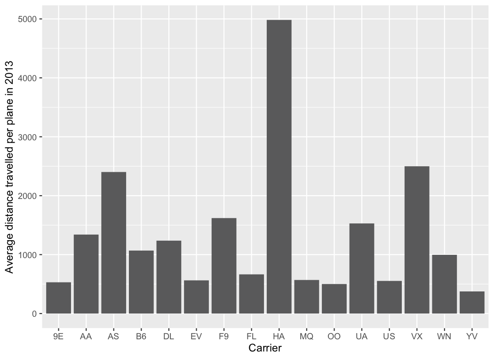

# Exploring data: Coding basics and data transformations using the nycflights13 (flights) dataset

**Load packages**
```
library(nycflights13) 
library(tidyverse)
library(dplyr)
library(ggplot2)
```

**View flights dataset structure**
```
str(flights)
```

**Display flights that had an arrival delay of >2 hours**
```
filter(flights, arr_delay > 120) 
```

**Display flights that flew to Houston**
```
filter(flights, dest == "HOU")
```

**Display flights operated by Delta**
```
filter(flights, carrier == "DL")
```

**Sort to find the fastest flights**
```
select(flights, year:day, distance, air_time) %>%
  mutate(speed = distance / air_time * 60) %>%
  arrange(desc(speed))
```

**Compare air_time vs. arr_time – dep_time**
```
df <- select(flights, air_time, arr_time, dep_time) %>%
  mutate(df,
       air_time,
       dep_to_arr = arr_time - dep_time
)
df
```

air_time does not show the same values as the amount of time between arrival time and departure time. 
This is because of the differences in time formats: 
  air_time is in minutes. 
  arr_time and dep_time are in HHMM format.
The following code can be used instead to convert the values in arr_time – dep_time to minutes:

```
df_converted <- select(flights, air_time, arr_time, dep_time) %>%
  mutate(df,
       air_time = air_time,
       arr_time_minutes = (arr_time %/% 100 * 60) + (arr_time %% 100),
       dep_time_minutes = (dep_time %/% 100 * 60) + (dep_time %% 100),
       dep_to_arr = arr_time_minutes - dep_time_minutes
)
df_converted
```
dep_to_arr is now closer to air_time, but there is still a discrepancy.
Possible explanations are arr_time and dep_time including time at the gate and taxi but not actual takeoff. 
There may also be data entry errors or unaccounted time difference issues since dep_to_arr is sometimes less than air_time.

**Display average distance travelled per plane by carrier in 2013**
```
test <- flights %>%
  group_by(carrier) %>%
  summarize(
    count = n(),        #Calculates the number of flights carried out by each carrier
    dist = sum(distance)   #Calculates total distance travelled by all planes of each carrier
  ) %>%
  mutate(distance_per_count = dist/count)

p <- ggplot(data = test) + geom_col(mapping = aes(x = carrier,
                                                  y = distance_per_count))
p + labs(x ="Carrier", y = "Average distance travelled per plane in 2013")
```
